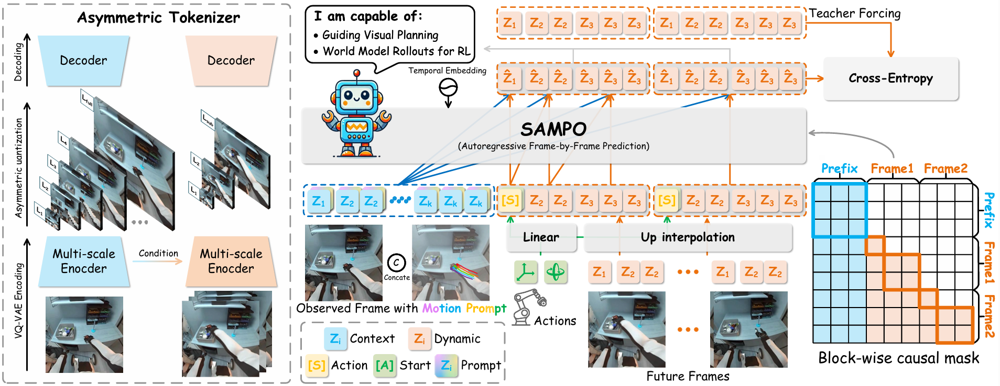
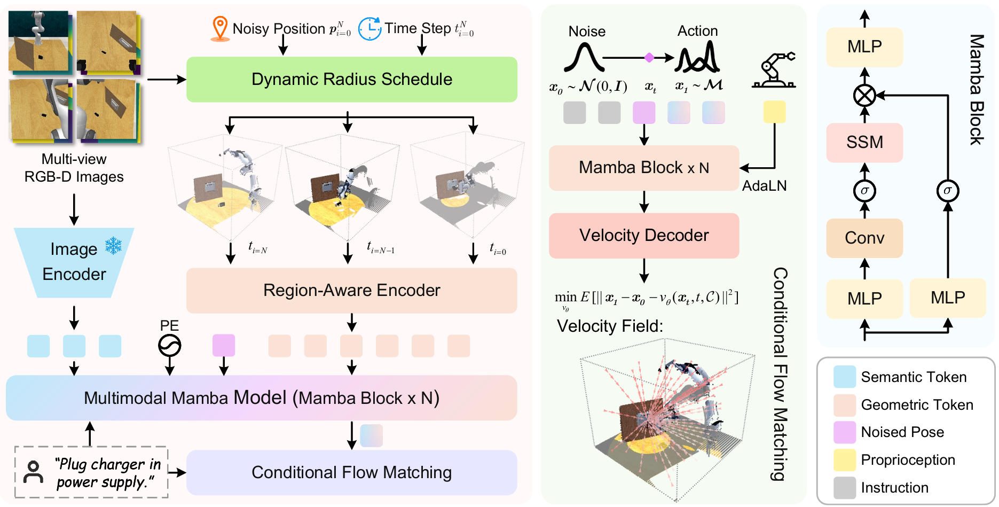
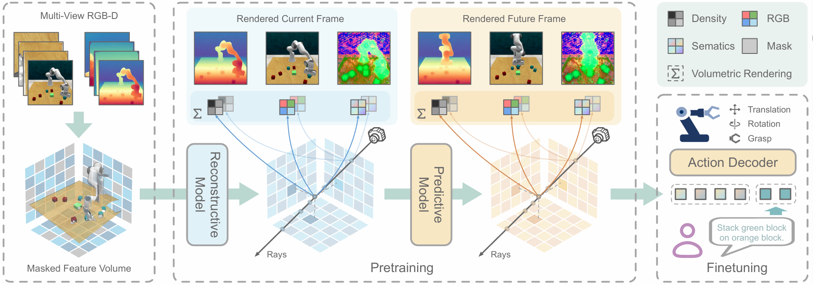
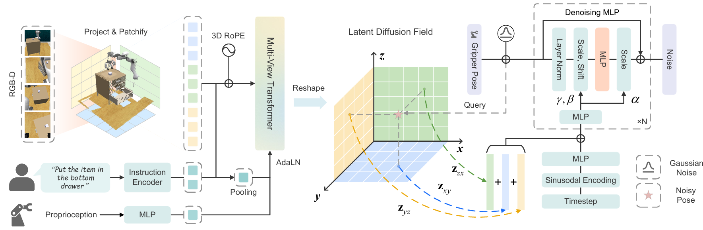








I am currently a third-year Ph.D. candidate in the Institute of Artificial Intelligence and Robotics at Xi'an Jiaotong University ([IAIR](https://iair.xjtu.edu.cn/index.htm), [XJTU](https://www.xjtu.edu.cn/)), where I am pursuing my doctoral studies under the guidance of Prof.[Le Wang](https://gr.xjtu.edu.cn/web/lewang). I also collaborate closely with Prof.[Sanping Zhou](https://gr.xjtu.edu.cn/web/spzhou), Prof.[Gang Hua](https://www.ganghua.org/) and Prof.[Wei Tang](https://www.cs.uic.edu/~tangw/).
Previously, I earned my B.Eng. in Control Science and Engineering from Jilin University.

My research interest focus on Robotic Manipulation, with particular emphasis on vision language action model and world model. I welcome any inquiries regarding potential collaboration in these areas.

# 🔥 News
- 2025.09: 🎉 Two papers were accepted to NeurIPS 2025.
- 2025.06: 🎉 PDFactor was selected for an **oral** presentation.  
- 2025.03: 🎉 Two papers were accepted to CVPR 2025.
- 2023.06: 🎓 Graduated from Jilin University.

# 📝 Selected Publications 
<!-- SAMPO -->

NeurIPS 2025

**SAMPO: Scale-wise Autoregression with Motion Prompt for Generative World Models**

**Sen Wang\***, Jingyi Tian, Le Wang†, Zhimin Liao, Jiayi Li, Huaiyi Dong, Kun Xia, Sanping Zhou, Wei Tang, Gang Hua

<!-- SAMPO -->

<!-- FlowRAM -->

CVPR 2025

**FlowRAM: Grounding Flow Matching Policy with Region-Aware Mamba Framework for Robotic Manipulation**

**Sen Wang\***, Le Wang†, Sanping Zhou, Jingyi Tian, Jiayi Li, Haowen Sun, Wei Tang

[[**Project**]](https://sanmumumu.github.io/FlowRAM/)&nbsp;
[[**Paper**]](https://openaccess.thecvf.com/content/CVPR2025/papers/Wang_FlowRAM_Grounding_Flow_Matching_Policy_with_Region-Aware_Mamba_Framework_for_CVPR_2025_paper.pdf)&nbsp;
[[**Code**]](https://github.com/SanMumumu/FlowRAM)

<!-- FlowRAM -->

# 📝 Collaboration Papers
<!-- DynaRend -->

NeurIPS 2025

**DynaRend: Learning 3D Dynamics via Masked Future Rendering for Robotic Manipulation**

Jingyi Tian, Le Wang†, Sanping Zhou, **Sen Wang\***, Jiayi Li, Hua Gang

<!-- DynaRend -->

<!-- PDFacotr -->

CVPR 2025 ORAL

**PDFactor: Learning Tri-Perspective View Policy Diffusion Field for Multi-Task Robotic Manipulation**

Jingyi Tian, Le Wang†, Sanping Zhou, **Sen Wang\***, Jiayi Li, Haowen Sun, Wei Tang

[[**Paper**]](https://openaccess.thecvf.com/content/CVPR2025/papers/Tian_PDFactor_Learning_Tri-Perspective_View_Policy_Diffusion_Field_for_Multi-Task_Robotic_CVPR_2025_paper.pdf)

<!-- PDFacotr -->

# 🏅 Honors and Awards
- *2024.10*, Academic Scholarship, XJTU
- *2024.06*, Runner-up in the 5th Embodied AI Workshop, CVPR [**(Cert.)**](../images/2024_Award_cvprws.png)
- *2023.10*, Freshman Scholarship, XJTU
- *2023.06*, Outstanding Graduates Student, JLU
- *2021.12, 2022.12*, National Encouragement Scholarship, MOE of PRC

# 💬 Invited Talks
- *2025.06.15*, Give an oral presentation on *Embodied Computer Vision* in Nashville at CVPR 25 conference. \|[**(Slide)**](https://cvpr.thecvf.com/media/cvpr-2025/Slides/35335.pdf) \| [**(Video)**](https://youtu.be/Y3P9wKyzLcM)

# 💻 Internships
- *2025.02 - present*, in [NOAH'S ARK LAB](https://noahlab.com.hk/#/home), China.

# 🎞️ Work Demos

  

    <!-- Slide 1：local mp4 -->
    

      <video controls playsinline preload="metadata">
        <source src="{{ '../videos/model_description.mp4' | relative_url }}" type="video/mp4">
      </video>
    

  

  <a class="prev" onclick="plusSlides(-1)">&#10094;</a>
  <a class="next" onclick="plusSlides(1)">&#10095;</a>

  

# 📖 Educations
- *2023.09 - present*, Ph.D. student, College of Artificial Intelligence, [Xi'an Jiaotong University](https://www.xjtu.edu.cn/), 
- *2019.09 - 2023.06*, B.S., Control Science and Engineering, [Jilin University](https://www.jlu.edu.cn/)
